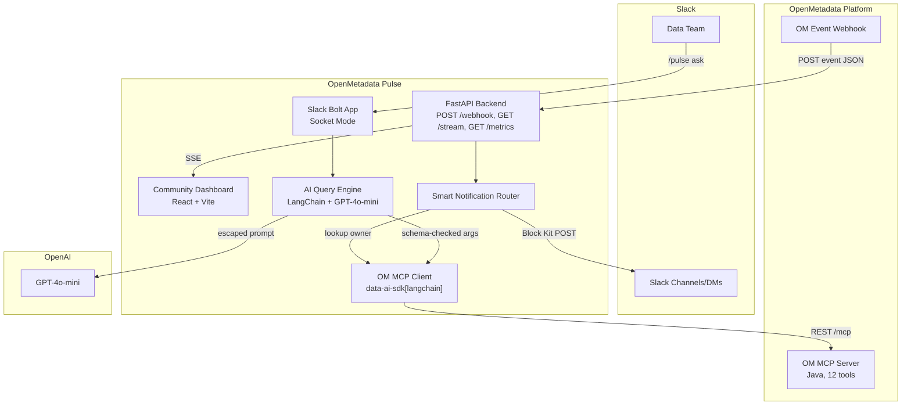

# Architecture Overview

## System Context Diagram

## Component Map

| Component | Responsibility | Technology |
|---|---|---|
| **Slack Bolt App** | Connects to Slack via Socket Mode. Receives `/pulse`, `@mentions`. | `slack-bolt` (Python) |
| **FastAPI Backend** | Receives OM Webhooks. Hosts SSE stream for the dashboard. | `fastapi`, `uvicorn` |
| **Smart Router** | Parses OM events, applies filtering rules, formats to Slack Block Kit, routes to owners. | Pure Python business logic |
| **AI Query Engine** | Interprets NL Slack messages, selects OM MCP tools, summarizes responses. | `langchain`, `data-ai-sdk` |
| **OM MCP Client** | Standardized wrapper for OpenMetadata MCP interactions. | `data-ai-sdk[langchain]` |
| **Dashboard UI** | Real-time view of community alerts and governance health. | React 18, Vite, Recharts |

## Core Workflows

### 1. Conversational Query (Pull)
1. User types `@Pulse which datasets have PII?` in Slack.
2. `slack-bolt` hands the text to LangChain Agent.
3. Agent prompts GPT-4o to select the `search_metadata` tool.
4. Agent executes tool via `data-ai-sdk`.
5. Agent summarizes JSON result into markdown/Slack Blocks.
6. `slack-bolt` replies to thread.

### 2. Smart Notification (Push)
1. OM Webhook triggers on a Schema Change event.
2. FastAPI `POST /webhook` endpoint validates the payload format.
3. `Router` parses the event, determining the affected `Table` FQN.
4. `Router` calls `get_entity_details` MCP tool to find the table's `owner`.
5. `Router` formats a Slack Block Kit message highlighting the schema diff.
6. `Router` dispatches the message via Slack API to the owner's DM (fallback: `#data-alerts` channel).
7. FastAPI broadcasts the event to connected Dashboard UI clients via Server-Sent Events (SSE).

## Design Principles

1. **Standalone & Non-Intrusive:** OpenMetadata is the source of truth. Pulse is a stateless presentation and routing layer.
2. **Defensive API Calls:** Circuit breakers (`pybreaker`) and retries (`tenacity`) on all external interactions (Slack API, OM MCP, OpenAI).
3. **Structured Logging:** Everything emits JSON logs with `request_id` context targeting 4 Golden Signals.
