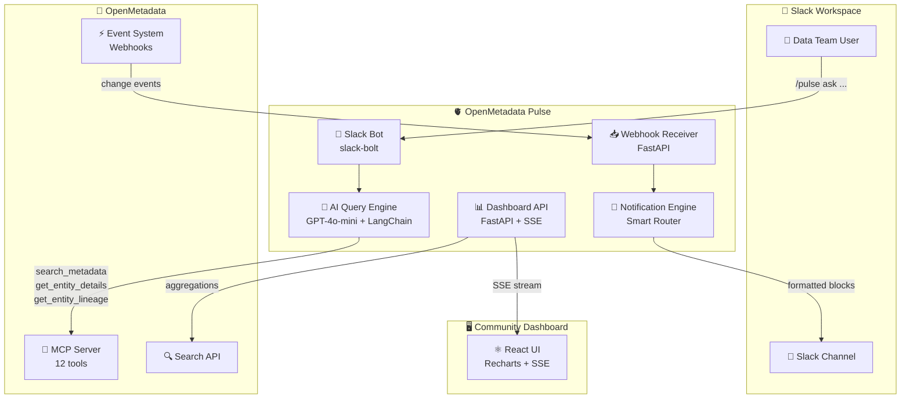

<p align="center">
  <h1 align="center">🫀 OpenMetadata Pulse</h1>
  <p align="center">
    <strong>AI-Powered Slack Bot & Team Collaboration Hub for OpenMetadata</strong>
  </p>
  <p align="center">
    <em>Stop drowning in tabs. Get metadata answers where your team already works — Slack.</em>
  </p>
</p>

<p align="center">
  <a href="LICENSE"></a>
  <a href="https://python.org"></a>
  <a href="https://openmetadata.org"></a>
  <a href="https://slack.com"></a>
</p>

---

## 🚀 The Problem

Data teams drown in **context-switching**. Schema changes break silently, data quality checks fail without notice, governance approvals stall — all trapped inside the OpenMetadata UI. Engineers juggle browser tabs, miss critical alerts, and waste hours chasing metadata across tools.

**Pulse fixes this.** It bridges OpenMetadata and Slack so your team gets actionable intelligence where they already work — no tab-switching, no missed alerts.

---

## 🏛️ Three Pillars

### 🤖 AI Slack Bot — Ask Anything, Get Answers Instantly

> `/pulse ask "which tables have no owner?"` → structured, sourced answers in seconds.

- Natural language queries powered by **GPT-4o-mini** + OpenMetadata MCP tools
- `/pulse lineage <table>` — instant lineage visualization
- `/pulse health` — data quality health check at a glance
- Supports entity search, metadata lookup, lineage tracing, and governance queries

### 🔔 Real-Time Notifications — Never Miss a Change

> Schema changed on `dim_customers`? The table owner gets a Slack DM within seconds.

- Webhook-driven: OpenMetadata events → Pulse → Slack in real time
- **Smart owner-based routing** — only the right people get notified
- Rich **Slack Block Kit** messages with actionable context
- Covers schema changes, DQ test failures, ownership updates, and more

### 📊 Community Dashboard — See Your Data Health at a Glance

> Live metrics, trends, and governance workflows — no OM login required.

- **Ownership coverage** — track how much of your catalog has owners
- **Data quality trends** — DQ pass/fail rates over time via Recharts
- **Governance board** — approval workflows and pending reviews
- Real-time updates via **Server-Sent Events (SSE)**

---

## ⚡ Quick Start

Get Pulse running in **3 commands**:

```bash
# 1. Clone
git clone https://github.com/nishanthatgit/openmetadata-pulse.git
cd openmetadata-pulse

# 2. Configure
cp .env.example .env
# Fill in: SLACK_BOT_TOKEN, SLACK_APP_TOKEN, OPENAI_API_KEY, OM_API_TOKEN

# 3. Run
docker-compose up
```

| Service | URL | Description |
|---------|-----|-------------|
| OpenMetadata | `http://localhost:8585` | OM Server |
| Pulse API | `http://localhost:8000` | Webhook receiver + Dashboard API |
| Dashboard | `http://localhost:3000` | Community Dashboard UI |

### 🔧 Local Development

```bash
# Install Python dependencies
pip install -e ".[dev]"

# Run the Slack bot
python -m pulse.bot

# Run the API server
python -m pulse.server

# Run tests
pytest

# Lint & type check
ruff check src/ tests/
mypy src/
```

---

## 🏗️ Architecture



### How It Works

1. **User asks a question** in Slack via `/pulse ask "..."` → Slack Bot receives the command
2. **AI Query Engine** interprets the natural language and selects the right MCP tools
3. **MCP Server** executes the query against OpenMetadata and returns structured data
4. **Bot responds** with a rich Slack Block Kit message — sourced, formatted, actionable
5. **Meanwhile**, OpenMetadata pushes change events → Webhook Receiver → Notification Engine routes alerts to the right owners in Slack
6. **Dashboard** displays live metrics via SSE — ownership, DQ trends, governance status

---

## 🛠️ Tech Stack

| Layer | Technology | Purpose |
|-------|-----------|---------|
| 🧠 **LLM** | OpenAI GPT-4o-mini | Natural language understanding & response generation |
| 🔗 **OM SDK** | `data-ai-sdk[langchain]` | OpenMetadata MCP tool integration |
| 💬 **Bot Engine** | `slack-bolt` | Slack command handling & message posting |
| ⚙️ **Backend** | FastAPI + Uvicorn | Webhook receiver, Dashboard API, SSE streaming |
| ⚛️ **Frontend** | React + Vite + Recharts | Community Dashboard with real-time charts |
| 🔒 **Config** | Pydantic Settings | Type-safe environment variable management |
| 📝 **Logging** | `structlog` | Structured, async-safe logging |
| 🧪 **Testing** | pytest + pytest-asyncio + respx | Async tests with HTTP mocking |
| 🔍 **Lint** | ruff + mypy | Fast linting + strict type checking |
| 🚀 **CI/CD** | GitHub Actions | Automated lint, test, and build pipeline |
| 🐳 **Deployment** | Docker Compose | One-command local deployment |

---

## 📈 Key Metrics & Outcomes

| Metric | Target |
|--------|--------|
| ⏱️ **Response time** | < 5s for NL queries via Slack |
| 📬 **Notification latency** | < 10s from OM event to Slack message |
| 📊 **Ownership visibility** | 100% coverage tracking across catalog |
| 🔄 **Context switches saved** | ~15 per engineer per day |

---

## 🤖 AI Disclosure

This project uses AI at two levels:

- **Runtime**: OpenAI **GPT-4o-mini** via LangChain + `data-ai-sdk` powers the Slack bot's natural language query engine
- **Development**: AI coding assistants were used during development

For full details, see [`AI_DISCLOSURE.md`](AI_DISCLOSURE.md).

---

## 👥 Team — Data Dudes

| Name | GitHub | Role |
|------|--------|------|
| 🧑‍💻 Nishant | [@nishanthatgit](https://github.com/nishanthatgit) | Tech Lead |
| 👩‍💻 Chellammal K | [@Chellammal-K](https://github.com/Chellammal-K) | Senior Builder |
| 👨‍💻 Igrock | [@Igrock007](https://github.com/Igrock007) | Builder |
| 📋 Naveen | [@pknaveenece](https://github.com/pknaveenece) | Delivery / Docs |

---

## 📄 License

Apache 2.0 — see [LICENSE](LICENSE).

---

<p align="center">
  <strong>Built with ❤️ for the OpenMetadata Community Hackathon 2025</strong>
</p>
