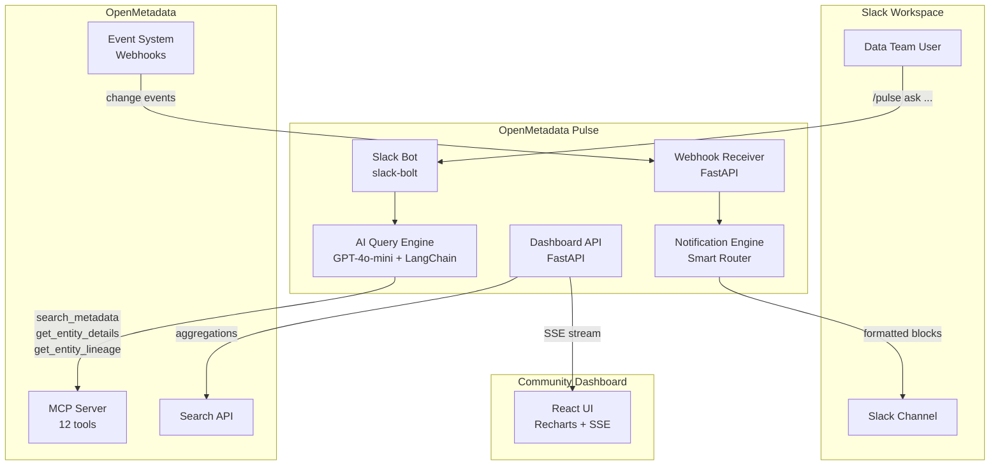

# OpenMetadata Pulse

> **AI-Powered Slack Bot & Team Collaboration Hub for OpenMetadata**

[](LICENSE)
[](https://python.org)

---

## What is Pulse?

Data teams drown in context-switching. Schema changes, failed data quality checks, governance approvals — all trapped inside the OM UI. **Pulse** bridges OpenMetadata and Slack so your team gets notified where they actually work.

### Three Pillars

| Pillar | Description |
|--------|-------------|
| 🤖 **AI Slack Bot** | `/pulse ask "which tables have no owner?"` — NL queries via GPT-4o-mini + OM MCP tools |
| 🔔 **Real-Time Notifications** | OM webhook → smart owner-based routing → Slack Block Kit messages |
| 📊 **Community Dashboard** | Live ownership coverage, DQ trends, governance workflow board |

---

## Quick Start

```bash
# 1. Clone
git clone https://github.com/nishanthatgit/openmetadata-pulse.git
cd openmetadata-pulse

# 2. Configure
cp .env.example .env
# Fill in your Slack and OpenAI tokens

# 3. Run
docker-compose up
```

---

## Architecture



---

## Tech Stack

| Component | Technology |
|-----------|------------|
| LLM | OpenAI GPT-4o-mini |
| OM SDK | `data-ai-sdk[langchain]` |
| Bot Engine | `slack-bolt` |
| Backend | FastAPI + Uvicorn |
| Frontend | React + Vite + Recharts + SSE |
| Testing | pytest + pytest-asyncio + respx |
| Lint | ruff + mypy |
| CI | GitHub Actions |
| Deployment | Docker Compose |

---

## AI Disclosure

Built with **OpenAI GPT-4o-mini** via LangChain + `data-ai-sdk` + `slack-bolt`.

---

## Team — Data Dudes

| Name | GitHub | Role |
|------|--------|------|
| Nishant | [@nishanthatgit](https://github.com/nishanthatgit) | Tech Lead |
| Chellammal K | [@Chellammal-K](https://github.com/Chellammal-K) | Senior Builder |
| Igrock | [@Igrock007](https://github.com/Igrock007) | Builder |
| Naveen | [@pknaveenece](https://github.com/pknaveenece) | Delivery / Docs |

---

## License

Apache 2.0 — see [LICENSE](LICENSE).
